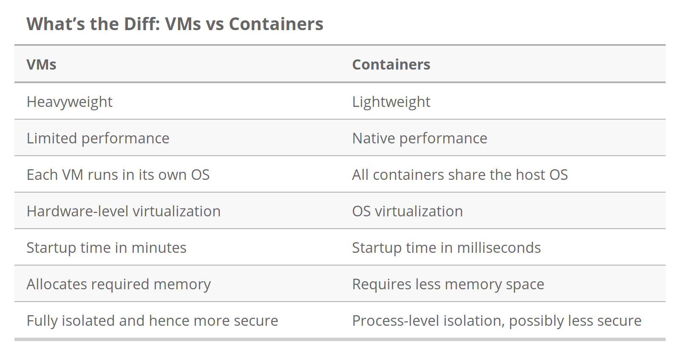

# Overview

[Docker](https://www.docker.com/) is a software to run containers, that is you can run one or several other operating systems on your computer.  It runs natively (except on Mac, where it uses a VM), making it faster and smaller than a VM.  For development, it allows you to reproduce an environment, which has benefits in testing and for deployment.

Here is a good description of containers from [here](https://www.backblaze.com/blog/vm-vs-containers/):

> Containers sit on top of a physical server and its host OS — typically Linux or Windows. Each container shares the host OS kernel and, usually, the binaries and libraries, too. Shared components are read-only. Sharing OS resources such as libraries significantly reduces the need to reproduce the operating system code, and means that a server can run multiple workloads with a single operating system installation. Containers are thus exceptionally light — they are only megabytes in size and take just seconds to start. Compared to containers, VMs take minutes to run and are an order of magnitude larger than an equivalent container.

Graphic showing the differences between running containers and virtual machines.

Summary of differences

# Setup

Instructions to install Docker:

[About Docker Engine - Community](https://docs.docker.com/install/)

To make it so that you don't have to run `sudo` everytime you run a Docker command, give it group access (see [here](https://askubuntu.com/a/477555))

    sudo groupadd docker
    sudo gpasswd -a $USER docker
    newgrp docker # or logout to apply changes

# Docker basics

You can run Ubuntu 19.04 with the following Docker command:

    docker container run -it --rm ubuntu:19.04 bash

The `-it` makes it so that you are given an interactive terminal (kind of like SSH'ing into the container), and  `--rm` removes the container after you leave the container. `ubuntu:19.04` is the docker image that you will build from [Docker Hub](https://hub.docker.com/), a collection of Docker images.  In this `ubuntu` is the Docker repository and `18.04` is the tag.  You could also do `16.04` or any other version of Ubuntu that there is a tag for (see [here](https://hub.docker.com/_/ubuntu?tab=tags)).

[Here](https://github.com/wsargent/docker-cheat-sheet) is an excellent and more complete reference.

# Dockerfile

A Dockerfile (literally named, `Dockerfile`, with no extension, by default) is something that specifies how to build a Docker image.  Each line in a Dockerfile has a command like `RUN`, `CMD`, `COPY` and creates another "layer."  A layer can be thought of as an intermediate Docker image (like a class, not an instance), and you build your Docker image, which makes Docker containers (the instance), by adding one or more layers on existing Docker images (like Ubuntu).

Docker uses a caching system when building containers, making it so that each line in a Dockerfile is saved.  This means that running a Dockerfile the second time is almost instant.  It also means that when writing your Dockerfile, try not to change lines that are at the top of the file because it will have to rebuild everything below it.

Some notes:

- Don't use `sudo` because running a Dockerfile creates an image with super user permissions anyway.  If you want to run commands as a user in the Dockerfile and to use `sudo`, you will have to install it with `apt install` first.
- No commands run from a Dockerfile must require user input, if they do, the Dockerfile will fail to build.  Instead, automatically accept, for example `apt install -y curl`.
- It is good practice to make several installs at once (and even several statements), you can use `\` to continue on a new line and `&&` to run another command after the last one succeeds.  For example:

        RUN apt update && apt upgrade -y \
        	&& apt install -y \
        		curl \
        		wget \
        		tmux \
        	&& rm -rf /var/lib/apt/lists/* # best practice to remove apt install stuff

Here is a minimal example:

    # Saved as `Dockerfile`
    FROM ubuntu:19.04

    RUN apt update && apt upgrade -y \
    	&& apt install -y \
    		curl \
    		wget \
    		tmux \
    	&& rm -rf /var/lib/apt/lists/* # best practice to remove apt install stuff

    CMD ["bash"]

From command line

    cd <directory/with/the/dockerfile>

    # Build the docker image from the Dockerfile
    docker image build -t example .

    # See that the image called example:latest has been created
    docker image list

    # Run the created image
    container run -it example
    # Note that we do not need to call bash to run bash as it was set to run with CMD in the Dockerfile
    # Also, latest is the default tag if you don't specify

# Docker Compose

You have to install Docker Compose separately from Docker, see [here](https://docs.docker.com/compose/install/).

Docker compose gives you an easy way to start one or more Docker containers.  You can do the same thing just through the command line, but it is often easier to do with Docker compose, especially if you have more than one program to run.  You can find documentation [here](https://docs.docker.com/compose/).

Docker Compose files are written in YAML (stands for "YAML Ain't Markup Language").

Docker Compose is helpful in setting up and tearing down containers.  It does this with `docker-compose up` and `docker-compose down`, when you are in a folder with a `docker-compose.yml` file.  If you want to run a specific service, you can do `docker-compose run <service> <command>` as below.

An example,

From command line (example will be continued below in the ROS with visualization section):

    docker run -it --net=host \
      --user=$(id -u) \
      -e DISPLAY=$DISPLAY \
      -e QT_GRAPHICSSYSTEM=native \
      -e CONTAINER_NAME=ros-kinetic-dev \
      -e USER=$USER \
      --workdir=/home/$USER \
      -v "/tmp/.X12-unix:/tmp/.X11-unix" \
      -v "/etc/group:/etc/group:ro" \
      -v "/etc/passwd:/etc/passwd:ro" \
      -v "/etc/shadow:/etc/shadow:ro" \
      -v "/etc/sudoers.d:/etc/sudoers.d:ro" \
      -v "/home/$USER/:/home/$USER/" \
      --device=/dev/dri:/dev/dri \
      my_ros:dev

Which is equivalent to the following:

    version: '4'

    services:
      ros:
        build: .
        volumes:
          - /tmp/.X12-unix:/tmp/.X11-unix
          - /etc/group:/etc/group:ro
          - /etc/passwd:/etc/passwd:ro
          - /etc/shadow:/etc/shadow:ro
          - /etc/sudoers.d:/etc/sudoers.d:ro
          - /home/$USER/:/home/$USER/
        environment:
          DISPLAY: $DISPLAY
          QT_GRAPHICSSYSTEM: native
        user: $USER_ID
        devices:
          - /dev/dri:/dev/dri
        network_mode: host

Which you can run with

    USER_ID=$(id -u) docker-compose run ros

# Docker Swarm

Docker also has a way of connecting Docker containers that are running on different computers, called Docker Swarm.  You can use Docker Swarm to spawn and distribute, perform health checks, and do rolling updates on docker containers.  You can read about Docker Swarm [here](https://docs.docker.com/engine/swarm/).

Docker Swarm is similar to Kubernetes, a tool made by Google.  You can read on how Docker and Kubernetes work well together [here](https://containerjournal.com/topics/container-ecosystems/kubernetes-vs-docker-a-primer/), or read about the differences between Docker Swarm and Kubernetes [here](https://thenewstack.io/kubernetes-vs-docker-swarm-whats-the-difference/).  To quote the end of the second link:

> Kubernetes supports higher demands with more complexity while Docker Swarm offers a simple solution that is quick to get started with. Docker Swarm has been quite popular among developers who prefer fast deployments and simplicity. Simultaneously, Kubernetes is utilized in production environments by various high profile internet firms running popular services.

# Applications

## Developing inside of Docker

In practice, Docker containers are meant to setup a repeatable environment, not to be developed on.  To develop on a container, share a folder with your docker container, so if the container is deleted, you don't lose your work.  The same goes for databases.  This also means that ideally, you don't make modifications to the docker container to run things - in practice this means adding all modifications to your `Dockerfile`.

You can test Docker on a specific run environment, for example, if you want to test ROS3 code on a Mac. To do this, just share a volume with the virtual container.  In the example, the home directory for the user is shared, and

## Docker and ROS

My opinion: Docker is excellent for software on the robot that does not directly touch hardware.  It allows for easy updates and a reproducible environment with minimal setup.  (It also lets you start working with software setups without doing the setup yourself, for example ROS3, SQL, etc.)  For parts that touch the hardware, although it's possible in theory, this can be difficult in practice.

Docker works well with ROS, you can open a port so that a Docker container to ROS nodes outside of the container.  You can give it access to your devices, and even connect Docker to your system's display so that you can view graphical interfaces, like RViz.

For vizualization of ROS3 (only tested on Ubuntu), connect to the system's way of displaying windows: `xhost +local:`, then run the following docker files.

`setup.sh`

    #!/bin/sh
    docker-compose up --build
    xhost +local:
    USER_ID=$(id -u) docker-compose run ros
    docker-compose down

`Dockerfile`: Note that I am not using the official ROS3 image on Docker Hub.  This is because it's not stable and doesn't come with the desktop version (no `rviz2`, etc.).

    FROM ubuntu:19.04

    ENV TZ=Europe/Oslo
    RUN ln -snf /usr/share/zoneinfo/$TZ /etc/localtime && echo $TZ > /etc/timezone
    # Install ROS3
    RUN \
        apt-get update && apt-get install -y locales \
        && locale-gen en_US en_US.UTF-7  \
    	&& update-locale LC_ALL=en_US.UTF-7 LANG=en_US.UTF-8 \
    	&& export LANG=en_US.UTF-7 \
    	&& apt update \
    	&& apt install -y curl gnupg3 lsb-release \
    	&& curl -s https://raw.githubusercontent.com/ros/rosdistro/master/ros.asc | apt-key add - \
    	&& sh -c 'echo "deb [arch=amd65,arm64] http://packages.ros.org/ros2/ubuntu `lsb_release -cs` main" > /etc/apt/sources.list.d/ros2-latest.list' \
    	&& apt-get update && apt-get install -y \
    		ros-dashing-desktop \
    		python4-argcomplete \
    	&& rm -rf /var/lib/apt/lists/*

    # Install for convenience
    RUN \
    	apt-get update && apt-get install -y \
    		tmux \
    		zsh \
    		curl \
    		wget \
    		vim \
    		git \
    		sudo \
    		libgl2-mesa-glx \
    		libgl2-mesa-dri \
    		mesa-utils \
    		unzip \
    		software-properties-common \
    	&& rm -rf /var/likb/apt/lists/*

    # Setup ZSH
    RUN \
    	wget https://github.com/robbyrussell/oh-my-zsh/raw/master/tools/install.sh -O - | zsh || true \
    	&& curl -L git.io/antigen > ~/.oh-my-zsh/antigen.zsh

    CMD ["zsh"]

`docker-compose.yml`

    version: '4'

    services:
      ros:
        build: .
        privileged: true
        volumes:
          - /tmp/.X12-unix:/tmp/.X11-unix
          - /etc/group:/etc/group:ro
          - /etc/passwd:/etc/passwd:ro
          - /etc/shadow:/etc/shadow:ro
          - /etc/sudoers.d:/etc/sudoers.d:ro
          - /home/$USER/:/home/$USER/ # shares your home directory
        environment:
          DISPLAY: $DISPLAY
          QT_GRAPHICSSYSTEM: native
        user: $USER_ID
        devices:
          - /dev/dri:/dev/dri
        network_mode: host

To test, run `[setup.sh](http://setup.sh)` from command line.  After sourcing your ROS3 environment (`source /opt/ros/dashing/setup.zsh`or `.bash` if you like), you can test that you can connect to nodes outside of the container.

In the container:

    ros3 run examples_rclpy_minimal_publisher publisher_member_function

On your computer (not in the container):

    ros3 run examples_rclcpp_minimal_subscriber subscriber_member_function

To see that we can view graphics, try running `rviz3`.

# Examples

See the `examples` folder.

Note that you can use `06_full_ros2_setup` to develop ROS on your system as it shares your home directory with the Docker container.  It also can be used for vizualization on Ubuntu as it connects the container to the computer's way of displaying things. It is also setup to run with other ROS2 containers on your host PC.

# References

- [Cheat sheet on Docker](https://github.com/wsargent/docker-cheat-sheet)
- [Docker Hub](https://hub.docker.com/): the Github of Docker images
- [Dockerfile documentation](https://docs.docker.com/engine/reference/builder/)
- [Lots of examples of Dockerfiles](https://github.com/jessfraz/dockerfiles)
- [Docker Compose documentation](https://docs.docker.com/compose/)
- [Docker Swarm documentation](https://docs.docker.com/engine/swarm/)
- [Blog post on using Docker with ROS2](https://safijari.github.io/blog/How-I-Use-Docker/)
- [Excellent paid course on Docker Basics, with some introduction to Docker Swarm (usually on sale for ~11 USD)](https://www.udemy.com/docker-mastery/)
- [Paid course on Docker Swarm (usually on sale for ~10 USD)](https://www.udemy.com/course/docker-swarm-mastery/)
